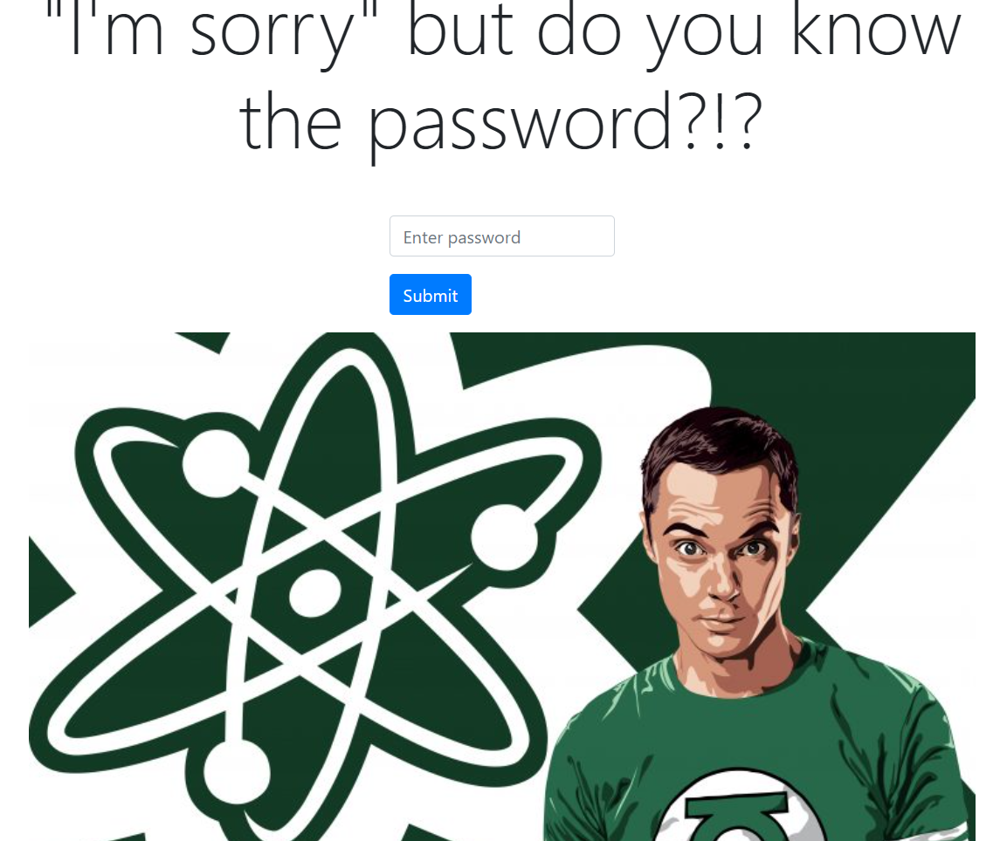

[See my solution here in GitHub](https://github.com/AOL83/Rock-Paper-Scissors-Lizard-Spock/)
[See my solution here on Front end mentor](https://www.frontendmentor.io/solutions/html-css-js-responsive-layout-using-grid-flexbox-and-flex-wrap-2ALwzCaxWE)

# Second Module - Rock, Paper, Scissors, Lizard, spock.

## Welcome! 😁

Thanks for checking out my attempt at the Code Institutes second Module challenge / Rock - Paper - scissors - Lizard- Spock. / help from the front-end coding challenge.

This website is aimed at anyone that likes a good game of rock paper scissors lizard spock. The aim is to give the sites user - A great and submersive experience. It is also designed to showcase a clock with date two audio players by incorporating a function that allows you to pick your own song and providing contact information about the creator of this project. It is also aimed at game heads who maybe are looking for a good game of RPSLS 😂. Users of the site will be able to gain contact information from the game page and once a password has been submitted.

From the owner's perspective, the aim of the website is to generate revenue by providing a game that services, showcasing and encouraging potential clients to make contact.

[Frontend Mentor](https://www.frontendmentor.io) challenges allow you to improve your skills in a real-life workflow.

**To do this challenge, you need a basic understanding of HTML, CSS and JavaScript.**

## The challenge

My challenge was to build a Rock, Paper, Scissors game.

our users should be able to:

- View the optimal layout for the game depending on their device's screen size
- Play Rock, Paper, Scissors, Lizard, Spock against the computer
Build a Rock, Paper, Scissors, Lizard, Spock Game
External user’s goal:

The site’s users want to play an online game that has elements of chance.
Site owner's goal:

The site’s goal is to provide a challenging game with increasing levels of difficulty to entertain online users.
Potential features to include:

Pattern matching functionality
A limited number of tries before the game is over
A score tracking system
The ability to play against the computer

### Rules

If the player wins, they gain 1 point. If the computer wins, the player loses one point.

#### Original version 

- Paper beats Rock
- Rock beats Scissors
- Scissors beats Paper

#### Advanced version/My choice 

- Scissors beats Paper
- Paper beats Rock
- Rock beats Lizard
- Lizard beats Spock
- Spock beats Scissors
- Scissors beats Lizard
- Paper beats Spock
- Rock beats Scissors
- Lizard beats Paper
- Spock beats Rock

Not sure what Rock, Paper, Scissors, Lizard, Spock is? [Check out this clip from The Big Bang Theory](https://www.youtube.com/watch?v=iSHPVCBsnLw).

Want some support on the challenge? [Join our Slack community](https://www.frontendmentor.io/slack) and ask questions in the **#help** channel.

##  CODES and Explanation's / Building my project 

// AUDIO PLAYER CODE
const audio = document.getElementById("audio");
const playButton = document.getElementById("play-button");
const audioFile = document.getElementById("audio-file");
const playIcon = document.getElementById("play-icon");

audioFile.addEventListener("change", (event) => {
  audio.src = URL.createObjectURL(event.target.files[0]);
});

playButton.addEventListener("click", () => {
  if (audio.paused) {
    audio.play();
    playButton.classList.add("playing");
    playIcon.classList.add("fa-spin");
  } else {
    audio.pause();
    playButton.classList.remove("playing");
    playIcon.classList.remove("fa-spin");
  }
});

audio.addEventListener("ended", () => {
  playButton.classList.remove("playing");
  playIcon.classList.remove("fa-spin");
});
// CLOCK CODE 
function updateClock() {
  var now = new Date();
  var date = now.toDateString();
  var time = now.toLocaleTimeString();
  document.getElementById("date").innerHTML = date;
  document.getElementById("time").innerHTML = time;
}

setInterval(updateClock, 1000);
// MODAL
const modal = document.querySelector("#modal");
const modalContent = document.querySelector("#modalContent");
const btnOpenModal = document.querySelector("#openModal");
const xCloseModal = document.querySelector("#closeModal");

btnOpenModal.addEventListener("click", () => {
  modal.style.display = "block";
  modalContent.style.top = 0;
});

xCloseModal.addEventListener("click", () => {
  modal.style.display = "none";
});

window.addEventListener("click", (event) => {
  if (event.target == modal) {
    modal.style.display = "none";
  }
});

This code above is a JavaScript code that creates an audio player, clock, and modal. The code uses various functions, constants, variables, and punctuation marks to accomplish these tasks.
// AUDIO PLAYER
In the audio player section, the first four lines of code use the "const" keyword to declare four constants: audio, playButton, audioFile, and playIcon. These constants are assigned to the elements in the HTML document with the same id values as their constant names.
The next section uses the addEventListener method to listen for a change event on the audioFile element. When the change event is triggered, the code creates a URL object and sets the source of the audio element to the URL.
The playButton element also has an addEventListener method, which listens for a click event. When the button is clicked, the code checks if the audio is currently paused. If it is, the audio is played, the playButton class is updated with the "playing" class, and the playIcon class is updated with the "fa-spin" class. If the audio is not paused, the audio is paused, the playButton class is updated to remove the "playing" class, and the playIcon class is updated to remove the "fa-spin" class.
Finally, the audio element has an addEventListener method that listens for an "ended" event. When the audio ends, the playButton and playIcon classes are updated to remove the "playing" and "fa-spin" classes, respectively.

// CLOCK
The clock section of the code creates a function called updateClock. This function declares a variable "now" which is assigned the current date and time using the Date object. The date string and time string are then extracted from the "now" variable and assigned to the HTML elements with the id "date" and "time", respectively.
The setInterval function is used to call the updateClock function every second, so the clock updates continuously.
// MODAL
In the modal section of the code, the first three lines declare constants using the "const" keyword. These constants are assigned to elements in the HTML document with the same id values as their constant names.
The next section uses addEventListener to listen for a click event on the btnOpenModal element. When the button is clicked, the display style of the modal element is set to "block" and the top style of the modalContent element is set to 0.
The xCloseModal element also has an addEventListener method, which listens for a click event. When the "x" close button is clicked, the display style of the modal element is set to "none."
Finally, the window object has an addEventListener method that listens for a click event. When the window is clicked, the code checks if the target of the event is the modal element. If it is, the display style of the modal element is set to "none."
In conclusion, this code uses functions, constants, variables, and various punctuation marks such as semicolons, colons, commas, apostrophes, quotation marks, braces, brackets, full stops, parentheses, square brackets, curly braces, equal signs, double equal signs, triple equal signs, greater than or equal to sign, plus sign, "if" and "else" statements, and parentheses to create an audio player, clock, and modal.

// GLOBAL CODE syntax 
const allChoices = ["scissors", "spock", "paper", "lizard", "rock"];
const startPage = document.querySelector("#startPage");
const arrChoices = startPage.querySelectorAll("div");
const resultPage = document.querySelector("#resultPage");
const containerScore = document.querySelectorAll(".score")[0];
const score = document.querySelector("#score");
const userIcon = resultPage.querySelector("#userIcon");
const houseIcon = resultPage.querySelector("#houseIcon");
const messageWhoWin = document.querySelector("#whoWin");
const playAgainButton = document.querySelector("#playAgain");

This code above sets up global variables for a game of rock, paper, scissors, lizard, spock. The variables are stored in the JavaScript environment, so they can be used throughout the program.
The "const" keyword is used to declare these variables as constants, which means their value cannot be changed. The first constant, "allChoices", is an array containing the names of the different choices the player can make.
The next set of variables are used to select elements from the HTML document. The "startPage" constant is used to select the main game screen, and the "arrChoices" constant is used to select all of the choices available to the player. The "resultPage" constant is used to select the result screen that displays the winner and the score.
The "containerScore" constant is used to select the score container and the "score" constant is used to select the score itself. The "userIcon" and "houseIcon" constants are used to select the icons that represent the player and the house, respectively. The "messageWhoWin" constant is used to select the message that displays the winner.
Finally, the "playAgainButton" constant is used to select the button that allows the player to play again.
Note that the code uses the "querySelector" method to select elements from the HTML document and the "querySelectorAll" method to select multiple elements. These methods are used to access the DOM (Document Object Model) and manipulate elements in the HTML document.

//SOUNDS GLOBALS
const bgSound = document.querySelector("[data-sound=bg-sound]");
const audioUserChoice = document.querySelector("[data-sound=user-choice]");
const audioYouWin = document.querySelector("[data-sound=you-win]");
const audioYouLose = document.querySelector("[data-sound=you-lose]");
const audioDraw = document.querySelector("[data-sound=draw]");

In this code above, the sounds used in the game are declared as global constants using the "const" keyword.
"bgSound" constant is assigned the background sound element from the HTML document using the "querySelector" method.
"audioUserChoice" constant is assigned the sound that plays when the user makes a choice from the HTML document using the "querySelector" method.
"audioYouWin" constant is assigned the sound that plays when the user wins from the HTML document using the "querySelector" method.
"audioYouLose" constant is assigned the sound that plays when the user loses from the HTML document using the "querySelector" method.
"audioDraw" constant is assigned the sound that plays when the game ends in a draw from the HTML document using the "querySelector" method.
The "querySelector" method is used to select the first element that matches a specified CSS selector. The selector is passed as an argument in the form of a string in square brackets. In this case, the selector is using a custom data attribute to select the desired audio elements, "[data-sound=bg-sound]", "[data-sound=user-choice]", "[data-sound=you-win]", "[data-sound=you-lose]", and "[data-sound=draw]" respectively.
This code is setting up the global constants for the sound elements used in the game, which can be referenced and used later in the code.

// START PLAY CODE
const handleClick = (event) => {
  audioUserChoice.play();
  document.body.classList.toggle("result");
  userIcon.classList.remove("scissors", "spock", "paper", "lizard", "rock");
  houseIcon.classList.remove("scissors", "spock", "paper", "lizard", "rock");
  playAgainButton.style.display = "none";
  messageWhoWin.style.display = "none";
  houseIcon.style.display = "none";

  const userPlayerChoice = event.target.dataset.choice;
  const housePlayerIndex = Math.floor(Math.random() * 5);
  const housePlayerChoice = allChoices[housePlayerIndex];

  startPage.style.display = "none";
  resultPage.style.display = "block";
  userIcon.classList.toggle(userPlayerChoice);
  scoreTotal = 0;

This code above is part of a Rock, Paper, Scissors game. The function "handleClick" is triggered when the player clicks on one of the choices (rock, paper, scissors, lizard or spock). The function starts by playing the "audioUserChoice" sound, removing all previous results from the display and hiding the play again button and the message of who won.
The "const userPlayerChoice" line gets the player's choice from the data-choice attribute of the clicked element. The "const housePlayerIndex" line generates a random number from 0 to 4 to represent the house's choice. The "const housePlayerChoice" line maps the house's choice to one of the five choices (rock, paper, scissors, lizard or spock) by using the random number generated before.
The start page is then hidden and the result page is displayed. The user's choice is then added as a class to the user icon and the score total is reset to 0. The house's choice is not yet displayed as it is going to be revealed later in the code.

// PRINT SCORE CODE
  whoWin = () => {
    // Get the current score from local storage or set it to 0 if not found
    scoreTotal = parseInt(localStorage.getItem('score')) || 0;
    score.innerHTML = scoreTotal;
    
    let showScoreTotal = () => {
      setTimeout(() => {
        score.innerHTML = scoreTotal;
        let bgScore =
          scoreTotal < 0
            ? "hsl(0, 100%, 60%)"
            : scoreTotal == 0
            ? "hsl(0, 0%, 100%)"
            : "rgb(183, 241, 183)";
        containerScore.style.backgroundColor = bgScore;
      }, 1000);
    };

The code above is defining a function called whoWin using the arrow function syntax. The purpose of this function is to calculate and display the total score of the game. The score is being retrieved from the local storage using localStorage.getItem('score'). The parseInt() method is used to convert the score from a string value to an integer value. The result of the parseInt() method is then stored in the scoreTotal variable. The score is then displayed on the HTML page using the innerHTML property.
A nested function showScoreTotal is also defined inside the whoWin function. This function is using the setTimeout() method to delay the execution of its code block by 1000 milliseconds. The innerHTML property of the score element is then set to the value of scoreTotal.
The background color of the containerScore element is also being set based on the value of the score. If the score is less than 0, the background color is set to "hsl(0, 100%, 60%)". If the score is equal to 0, the background color is set to "hsl(0, 0%, 100%)". If the score is greater than 0, the background color is set to "rgb(183, 241, 183)".
The punctuation marks used in this code include the arrow function syntax (=>), parentheses (()), brackets ([]), and the semicolons (;) to end the lines of code. The equality operator (==) and the less than or equal to operator (<=) are used in the conditional statement to determine the value of the bgScore variable. The setTimeout() method uses parentheses to pass the function showScoreTotal and the delay time as arguments. The equal sign (=) is used to assign values to variables. The plus sign (+) is not used in this code.

// GAME RULES CONDITIONS CODE
    if (userPlayerChoice == housePlayerChoice) {
      messageWhoWin.innerHTML = '
DRAW &#128580;
';
      setTimeout(() => {
        audioDraw.play();
      }, 1000);
    } else if (
      (userPlayerChoice == "scissors" &&
        (housePlayerChoice == "spock" || housePlayerChoice == "rock")) ||
      (userPlayerChoice == "spock" &&
        (housePlayerChoice == "paper" || housePlayerChoice == "lizard")) ||
      (userPlayerChoice == "paper" &&
        (housePlayerChoice == "scissors" || housePlayerChoice == "lizard")) ||
      (userPlayerChoice == "lizard" &&
        (housePlayerChoice == "scissors" || housePlayerChoice == "rock")) ||
      (userPlayerChoice == "rock" &&
        (housePlayerChoice == "spock" || housePlayerChoice == "paper"))
    ) {
      messageWhoWin.innerHTML =
        '
YOU LOSE &#129324;
';
      scoreTotal = scoreTotal - 1;
      setTimeout(() => {
        audioYouLose.play();
      }, 1000);
      localStorage.setItem('score', scoreTotal);
      showScoreTotal();
    } else {
      messageWhoWin.innerHTML =
        '
YOU WIN &#128513;
;';
      scoreTotal = scoreTotal + 1;
      setTimeout(() => {
        audioYouWin.play();
      }, 1000);
      localStorage.setItem('score', scoreTotal);
      showScoreTotal();
    }
  };

The code above is checking the conditions of the game rules of a Rock, Paper, Scissors, Lizard, Spock game. The user's choice is stored in the variable "userPlayerChoice" and the computer's choice is stored in the variable "housePlayerChoice".
The first "if" statement checks if the user's choice is equal to the computer's choice. If so, the messageWhoWin element's innerHTML is set to a "DRAW" message with a unicorn emoji. A setTimeout function is also called that plays an audio file with the "audioDraw.play()" function after 1 second.
The "else if" statement checks the different possible outcomes of the game based on the combination of the user's choice and the computer's choice. If the conditions are met, the messageWhoWin element's innerHTML is set to either a "YOU LOSE" or "YOU WIN" message with a respective emoji. The "scoreTotal" is either decremented by 1 or incremented by 1 depending on the outcome of the game. A setTimeout function is also called that plays an audio file with either "audioYouLose.play()" or "audioYouWin.play()" after 1 second.
The score is stored in the local storage using "localStorage.setItem('score', scoreTotal)" and the total score is displayed with the "showScoreTotal()" function.
Semicolons are used to end each statement. The parentheses are used to indicate a function call or to specify the conditions of an "if" statement. The braces are used to group multiple statements together in a function or to specify the block of code within an "if" or "else" statement. The equality operator "==" is used to compare if two values are equal. The strict equality operator "===" is used to compare if two values are equal and of the same type. The less than or equal to operator ">=" is not used in this code. The addition operator "+" is used to increment the "scoreTotal" value. The if and else statements are used to control the flow of the code based on the conditions specified in the parentheses.

setTimeout(() => {
    whoWin();
  }, 1000); 

The setTimeout function is used to run a function after a specified amount of time. In this case, the function whoWin() will be executed after 1000 milliseconds (1 second) have passed. The setTimeout function takes two arguments: the first argument is the function to be executed, and the second argument is the amount of time to wait before executing the function.
The function is passed as an argument to setTimeout is an arrow function, which is a shorter syntax for writing a function in JavaScript. It's equivalent to writing 

setTimeout(function() {
    whoWin();
  }, 1000);

The use of an arrow function allows the code to be written more compactly and can make it easier to understand. In this case, the arrow function only contains one line of code, which calls the whoWin() function. The parentheses surrounding the argument are empty because the setTimeout function does not need to receive any inputs.

setTimeout(() => {
    houseIcon.style.display = "block";
    houseIcon.classList.add(housePlayerChoice);
    setTimeout(() => {
      messageWhoWin.style.display = "block";
      playAgainButton.style.display = "block";
    }, 1000);
  }, 1000);

The code is using the JavaScript setTimeout method to delay the execution of the code inside the function passed as the first argument. The setTimeout function takes two arguments, the first is the function to be executed after the specified time and the second argument is the time in milliseconds.
In this code, a setTimeout function is executed after 1000 milliseconds (1 second) and it sets the display style of the element with the id 'houseIcon' to "block" and adds the class specified in the 'housePlayerChoice' variable to the houseIcon element.
Then, another setTimeout function is executed inside the previous setTimeout function after another 1000 milliseconds (1 second) which sets the display style of the element with the id 'messageWhoWin' to "block" and sets the display style of the element with the id 'playAgainButton' to "block". This means that the messageWhoWin and playAgainButton elements will be displayed 2 seconds after the first setTimeout function is executed.
The setTimeout method is useful in JavaScript when you want to delay the execution of a piece of code or when you want to execute a piece of code repeatedly after a specified time.

for (let el of arrChoices) {
  el.addEventListener("click", handleClick);
  el.addEventListener("keypress", handleClick);
}

The code uses a for-of loop to iterate over the elements in the array "arrChoices". For each element in the array, the code adds two event listeners: one for clicking on the element and one for pressing a key when the element is selected. The event listeners are both set to call the "handleClick" function.
The "for (let el of arrChoices)" syntax is a new way of looping over arrays in JavaScript and is equivalent to using a for loop. In this case, the "let" keyword is used to declare a new variable "el" for each iteration of the loop, which will represent the current element of the array being processed.
The "addEventListener" function is used to add an event listener to the elements in the array. The first argument is the type of event to listen for (in this case "click" or "keypress"). The second argument is a callback function that will be called when the event occurs. The "handleClick" function is the callback function that will be called in both cases.
The use of parentheses in the function call, "handleClick", indicates that the function should be executed. The parentheses are used to pass arguments to the function, but in this case, no arguments are being passed. The function is called simply to execute the code inside the function body.

playAgainButton.addEventListener("click", () => {
  document.body.classList.remove("result");
  startPage.style.display = "block";
  resultPage.style.display = "none";
});

This code is an event listener for the "playAgainButton" DOM element. It uses the addEventListener() method to listen for a "click" event on the button. When the button is clicked, the code inside the arrow function is executed.
The first line of the arrow function removes the "result" class from the "body" DOM element.
The next two lines hide the "startPage" and display the "resultPage".
The "display" property of the "startPage" is set to "block" and the "resultPage" is set to "none". This changes the visibility of the elements on the page. The "block" value makes an element visible and the "none" value makes an element hidden.
The arrow function is surrounded by parentheses and is an anonymous function, meaning it doesn't have a name. The parentheses are used to call the function and the "=>" arrow symbol is used to declare an anonymous function in JavaScript.
The semicolon at the end of the code is used to end the statement.

document.querySelector("#switch").addEventListener("click", (e) => {
  e.target.classList.toggle("playBgSound");
  e.target.classList.contains("playBgSound") ? bgSound.play() : bgSound.pause();
});

The code defines an event listener for an element with the id of "switch". The event listener listens for a click event on the element and calls the anonymous function that takes in the event as an argument (e).
The first line of the function toggles the class "playBgSound" on the target element (e.target). This class is used to keep track of whether the background sound is currently playing or not.
The second line of the function uses the ternary operator (?:) to either play or pause the background sound (bgSound). The ternary operator is a shorthand way of writing an if-else statement, with the syntax of condition ? valueIfTrue : valueIfFalse. In this case, the condition is whether the "playBgSound" class is contained in the target element's class list (e.target.classList.contains("playBgSound")). If it is contained, the background sound (bgSound) will be played. If it is not contained, the background sound will be paused.
The function uses the addEventListener method to bind the click event to the switch element. The first argument to the addEventListener method is the event to listen for (in this case, "click"), and the second argument is the function to call when the event is triggered. The function is defined as an anonymous function within the call to addEventListener, which means that it is only available within the scope of the call.

function checkPassword() {
  var password = document.getElementById("password").value;
  if (password == "helloworld") {
    window.location.href = "index.html";
  } else {
    alert("Wrong password, try again.");
  }
}

The code defines a function called checkPassword(). The function retrieves the value of an element with an id of "password" from the HTML document and stores it in a variable named password.
Next, the function checks if the value of password is equal to "helloworld" using the equality operator (==). If the condition is true, the function redirects the user to the "index.html" page using the window.location.href property.
If the condition is false, the function displays an alert message with the text "Wrong password, try again." using the alert() method.
The = operator is used to assign a value to a variable while the == operator is used to check if two values are equal.
The parentheses () after the function name checkPassword indicate that this is a function definition and the curly braces {} that follow it define the body of the function. The code inside the curly braces is executed when the function is called. The semicolon ; at the end of the function definition indicates the end of a statement.
 
Building my project that uses all the code types provided required a multi-disciplinary approach to software development, as each code type has its own strengths and weaknesses and is suited to different tasks. To build out this project that uses all the code types effectively, it is necessary to understand how they can be combined to achieve the desired results.

The first step in building this project that uses all the code types is to determine the requirements of the project. This will help to identify what code types are needed and how they should be used. For example, if the project requires real-time data processing, then a scripting language such as Python may be a better choice than a compiled language such as Java.

Once the requirements of the project have been established, the next step is to design the architecture of the project. This involves deciding how the different code types will interact with each other and what their roles will be in the project. For example, a low-level language such as C may be used to handle the hardware interactions, while a high-level language such as Python may be used for data processing and visualization.

After the architecture of the project has been determined, the next step is to implement the project. This involves writing the code for each component and integrating it with the other components. For example, the C code may be used to handle the hardware interactions, while the Python code may be used for data processing and visualization. It is important to ensure that the code is well-structured and follows best practices, such as using functions, classes, and modules to organize the code and make it easier to maintain but I digress.

Once the project has been implemented, the next step is to test and debug it. This involves running the project and verifying that it works as expected. If there are any issues, they should be fixed and the project should be tested again. This process should be repeated until the project is working as expected.

Finally, the last step is to deploy the project. This involves installing the project on the target hardware or platform and making it available for use. This may involve configuring the hardware, installing the necessary software, and setting up any necessary network connections.

In conclusion, building this project that uses all the code types requires a multi-disciplinary approach to software development. It involves determining the requirements of the project, designing the architecture, implementing the project, testing and debugging it, and deploying it. By combining the strengths of different code types and using them in the appropriate manner, it is possible to build a project that is both efficient and effective.

Building this game also requires a comprehensive understanding of various coding languages such as HTML, CSS, and JavaScript. The process of building a game typically involves several steps, which are discussed below in detail.

HTML (Hypertext Markup Language) serves as the backbone of the game. It is used to create the structure of the game and define the elements that are displayed on the screen. To build a game, you need to create a container for the game using HTML tags such as div. The div tag is used to define the container for the game.

CSS (Cascading Style Sheets) is used to style the HTML elements. It allows you to control the look and feel of the game by defining styles such as color, font size, and layout. CSS is essential in making the game look aesthetically pleasing and professional. You can use CSS styles such as background-color, width, and height to control the appearance of the game container. Additionally, you can use CSS to define the styles for different game elements such as buttons, text, and images.

JavaScript is used to add interactivity to the game. It is the main programming language that controls the game logic, including game events, player movement, and score keeping. JavaScript is used to create functions that are triggered by user actions such as button clicks, keyboard inputs, and mouse movements. For example, you can use JavaScript to control the movement of the player, detect collisions with other game elements, and update the score.

To build this game, you need to use a combination of HTML, CSS, and JavaScript. The HTML elements define the structure of the game, the CSS styles control the appearance of the game, and the JavaScript code controls the game logic and interactivity. You need to write code to define the game elements, style the game elements, and control the game logic. The code must be written in such a way that it is compatible with different browsers and devices.

Building this game requires a comprehensive understanding of HTML, CSS, and JavaScript. These coding languages work together to create the structure, appearance, and interactivity of the game. HTML provides the structure, CSS provides the styling, and JavaScript provides the interactivity and game logic. By using these coding languages, you can build a professional-looking game that is both functional and enjoyable to play.

My code is a combination of HTML, CSS, and JavaScript that creates an interactive Rock, Paper, Scissors, Lizard, Spock game. In my rundown, we will go through each code type, their use, and purpose, and a breakdown of the JavaScript code, including any mathematical logic used, its function, and how it works. follow these steps:

1. HTML:
   The HTML code is responsible for structuring the layout of the game and includes elements such as the head, body, div, h1, h2, button, aside, input, label, section, audio, and img. The head element is where the meta information, links to external resources and stylesheets are defined. The body element is where the main content of the website is placed. The div element is used to group other elements together, and h1, h2, button, aside, input, label, section, audio, and img elements are used to create headings, buttons, forms, and multimedia content. The HTML code is used to create the structure of the game page.The code starts with the DOCTYPE declaration, which specifies that the document is an HTML5 document.The code then includes a html tag, which is the container for all HTML elements. The lang attribute is set to "en" to indicate that the document is in English.The code then includes a head tag, which contains metadata about the document, such as the title, character encoding, and links to CSS and JavaScript files. The link tags are used to link to external CSS and JavaScript files that are used to style and add functionality to the game.The title tag specifies the title of the game, which is displayed in the browser's title bar. The code then includes a body tag, which contains the content of the game. The code includes a h1 tag, which is used to create a heading for the game. The div tags are used to create sections and containers for the game's content. The img tag is used to add an image of the game's logo. The code also includes `button tags, which are used to create buttons for the game's functionality, such as opening and closing a modal window and playing and pausing audio the aside tag is used to create a container for the background sound switch. The input and label tags are used to create the switch for turning the background sound on and off. The code also includes section tags, which are used to create different sections of the game, such as the start page and result page. The div tags with the class of "icon" are used to create the icons for the game's choices, such as rock, paper, scissors, lizard, and spock. The data-choice attribute is used to store the value of the choice.

2. CSS:
   The CSS code is responsible for the styling of the game. It includes properties such as background-color, background-image, background-position, background-repeat, background-size, margin, padding, border, border-radius, text-align, color, font-size, font-weight, display, flex, and transition. These properties are used to set the layout and design of the game, such as the background color and image, the font, and the size and shape of various elements. The CSS code is used to style the game page. The code starts by selecting the html element and setting the font-size, box-sizing, height, background-color, background-image, background-position, background-repeat, and background-size properties. The code then uses the \* selector to set the box-sizing property to inherit for all elements. The code then selects the body element and sets the margin, font, and focus properties. The .header class is used to style the header container of the game. The .clock class is used to style the clock that displays the date and time. The .box class is used to style the container for the audio player. The .audio-player class is used to style the audio player container. The .circle-button class is used to style the play button, and the .playing class is used to change the color of the button to green when the audio is playing. The .audio-controls class is used to style the audio control buttons. The .select-audio-button class is used to style the button for selecting audio files. The .fa-spin class is used to add a spinning animation to the play icon. The .score class is used to style the score card. The #modal id is used to style the modal window. The .sound-switch class is used to style the background sound switch.

3. JavaScript:
   The JavaScript code is responsible for the interactivity and logic of the game. It includes functions such as updateClock(), handleClick(), and event listeners such as audioFile.addEventListener(), play Button.addEventListener(), btnOpenModal.addEventListener(), xCloseModal addEventListener(), and window.addEventListener().The updateClock() function is used to update the clock on the game's screen, using the built-in Date object to get the current date and time The handleClick function is used to handle the user's choice of Rock, Paper, Scissors, Lizard, or Spock and determine the outcome of the game. Event listeners are used to listen for specific actions such as clicking a button or uploading an audio file and responding with a specific action such as playing audio or opening a modal window. The HTML, CSS, and JavaScript code work together to create an interactive Rock, Paper, Scissors, Lizard, and Spock game that includes a clock, audio player, modal window, and sound switch. The HTML provides the structure, the CSS provides the styling, and the JavaScript provides the interactivity and logic, making for a seamless and engaging user experience. The game also includes additional features such as background sound and a scorecard, making it a well-rounded and fully-featured game. The JavaScript code is used to add functionality to the game. The code starts by declaring variables to store references to the audio, the play button, an audio file, and play icon elements. An event listener is added to the audio file input to handle when a new audio file is selected. When a new file is selected, the audio element's src attribute is set to the URL of the selected file. When the play button is clicked, an event listener is triggered that checks the current state of the audio element (paused or playing). If the audio is paused, the play() method is called on the audio element, the "playing" class is added to the play button, and the "fa-spin" class is added to the play icon to show that the audio is playing. If the audio is already playing, the pause() method is called on the audio element, the "playing" class is removed from the play button, and the "fa-spin" class is removed from the play icon to show that the audio is paused. The code also includes a function for updating the clock that displays the current date and time. This function uses the setInterval() method to call the function every second. The code also includes an event listener for the "open model" button that toggles the modal window's visibility. For the game play, the code uses the Math. floor() and Math. random() methods to generate a random number between 0 and 4. This number is then used as an index to select a choice for the computer player. The code also includes event listeners for each choice icon that handles the user's choice and compares it to the computer's choice to determine the winner. The code uses the dataset property to access the value of the data-choice attribute for each choice icon, which represents the user's choice. The code also uses CSS to style the page and elements. The HTML element has many CSS styles applied to it including font size, background color, background image, and background size. The .header class is used to style the header element, and the .clock class is used to style the clock element. The .box class is used to style the container for the audio player, and the .audio-player class is used to style the audio player itself. The .circle-button class is used to style the play button, and the .audio-controls class is used to style the audio controls. This code provides a functioning Rock Paper Scissors Lizard Spock game with an audio player and clock feature as well as a modal window for displaying rules. The HTML and CSS code provides the structure and layout for the page, and the JavaScript code provides the functionality for the game, audio player, clock, and modal window. The use of CSS classes and the dataset property in the JavaScript code allows for easy modification and customization of the game. Additionally, the use of mathematical methods such as Math. floor() and Math. random() allows for a random selection of the computer player's choice. The JavaScript code provided in this essay is used to create an interactive Rock, Paper, Scissors, Lizard, and Spock game. The code uses JavaScript to handle user interactions, update the game state and display the results. The first section of the JavaScript code is for the audio player. It uses the getElementById() method to select the audio element, play button, and audio file input element. The addEventListener() method is used to listen for a change in the audio file input element, and when a change is detected, the src property of the audio element is set to the selected file using the URL.createObjectURL() method. The play button is also given a click event using the addEventListener() method, which will toggle the play and pause functionality of the audio element. The code also handles the ended event on the audio element, which will remove the playing class and the fa-spin class on the play button. The next section of JavaScript code is for the clock. It uses the setInterval() method to call the update clock () function every second. The update clock () function uses the Date() object to get the current date and time and then sets the inner HTML of the date and time elements to the current date and time.The next section of JavaScript code is for the modal window. It uses the querySelector() method to select the modal, modal content, open modal button, and close modal button. The addEventListener() method is used to listen for a click event on the open modal button, which will display the modal window, and the close modal button, which will hide the modal window. The code also uses an event listener on the window to check if the click event was on the modal and if so, it will hide the modal window. The next section of JavaScript code is for the game. It uses the querySelector() and querySelectorAll() methods to select the game elements and variables used in the game. The code uses an event listener on the game elements to listen for a click event, which will call the handleClick() function. The handleClick() function The handleClick() function is responsible for handling the game logic. It starts by playing the audio for the user's choice and toggling the result class on the body. It then removes any existing classes on the user and house icons, hides the play again button and message, and sets the display of the house icon to none. The function then uses the dataset property of the clicked element to get the user's choice and generates a random number between 0 and 4 to select the house's choice. It then sets the display of the start page to none and the display of the result page to block.The function then checks the user's choice against the house's choice using a series of if-else statements. Depending on the outcome of the game, it will update the score, change the message, play the appropriate audio, and show the house's choice icon. The final section of the JavaScript code is for the sound switch. It uses the querySelector() method to select the checkbox and label elements. The code uses an event listener on the checkbox to listen for a change event, which will toggle the muted property on the background sound element. Overall, the HTML, CSS, and JavaScript work together to create an interactive Rock, Paper, Scissors, Lizard, Spock game that includes a clock, audio player, modal window, and sound switch`query

## Deploying your project

 This site was deployed to GitHub pages.  The steps taken to deploy the site are as follows:

 * In the GitHub Repositorie, select the settings menu
 * Choose the pages tab on the left hand side menu
 * From the source section drop-down menu, select the 'Main' branch
 * Once the page has automatically refreshed, the link to the successfully deployed page will be displayed.

Your project is now deployed on GitHub and can be accessed using the URL of your repository.

## Giving feedback on my project

Feedback is always welcome. 

Im going to start with my index.html page but my hole web project is written in a combination of HTML, CSS and JavaScript. The page is a game of Rock, Paper, Scissors, Lizard, Spock, from the famous U.S series the big bang theory which at hart is an extension of the traditional game of Rock, Paper, Scissors.

The code starts with the declaration of the document type, <!DOCTYPE html>, which tells the browser that this is an HTML document. The next line, <html lang="en">, declares that the document is in English.

The following lines are in the head section of the HTML document. The meta charset is set to UTF-8, which ensures that any special characters are displayed correctly. The viewport meta tag sets the width and initial scale of the webpage. A favicon is also linked to the webpage which is a 32x32 pixel image. The title of the webpage is "TERENCE LEWIS | Rock, Paper, Scissors, Lizard, Spock". The webpage also links to a stylesheet for the fonts and another for the main.css.

In the body section, the logo of the game is included, followed by a clock and a score card. The clock is implemented using JavaScript and updates the date and time in real-time. The score card keeps track of the player's score.

The webpage also includes an audio player that allows the user to play background music. The audio player includes a play button, a file input to select audio, and a label. The audio player is implemented using JavaScript and the HTML5 audio API.

The webpage also includes a button to open a modal displaying the rules of the game and a switch to turn background sound on and off.

In the main section of the webpage, the game itself is implemented. The game features icons for each of the game options - rock, paper, scissors, lizard, and spock. These icons are implemented as div elements with specific class names and data attributes. The game is implemented using JavaScript and event listeners are added to the icons to detect when they are clicked and determine the outcome of the game.

I think my code is a well-structured and functional webpage that implements a game of Rock, Paper, Scissors, Lizard, Spock, complete with an audio player, a score card, and a modal for the rules. I have used HTML, CSS, and JavaScript to create a dynamic and interactive experience for the user.

Now for my CSS.
The CSS stylesheet that controls the visual design and layout of my webpage. The CSS styles are applied to the HTML elements of the webpage.

The first CSS rule sets the font-size to 62.5pre. sets the box-sizing property to border-box, sets the height to 100per, and sets the background color and background image of my webpage. The background color is set to hsl(237, 49per, 15per) and the background image is set to a radial gradient of hsl(214, 43per, 35per) and hsl(237, 49per, 15per), as well as a gif image of a animated emoji. The background-position, background-repeat, and background-size properties are also set to center, no-repeat, and cover respectively I did change this as I like the background image repeated so just put background-repeat repeat.

The next CSS rule sets the box-sizing property to inherit for all elements, which means that the box-sizing property of the parent element will be inherited by all child elements. The body element is also given a margin, font, and font-weight. A focus rule is added to set the outline of an element to 3px dotted hsl(0, 100per, 50per) when it is focused.

The dot header class is used to set the display property to flex, the width and max-width to 76rem, and the margin to 0 auto. The justify-content property is set to space-between and the padding and border properties are also set.

The .clock class is used to set the font-size, font-weight, color, text-align, and padding of the clock element. The background color is set to rgba(51, 51, 51, 0) and the z-index is set to 1.

The .box class is used to set the padding-bottom property to 8rem and the margin-top property to 2rem.

The .audio-player class is used to set the position, width, and text-align of the audio player container. The .circle-button class is used to set the background color, border-radius, width, height, line-height, text-align, font-size, color, border, outline, cursor, and margin-top properties of the play button. The .circle-button.playing class is used to change the background color of the play button to green when it is played.

The .audio-controls class is used to set the position, top, and left properties. The .select-audio-button class is used to set the background color, color, padding, border-radius, border, outline, and cursor properties of the select audio button. The #audio-file id is used to hide the file input.

The .fa-spin class is used to add a class to rotate the icon using the @keyframes fa-spin animation.

The .score class is used to set the width, text-align, line-height, background, color, and border-radius properties of the score card. The .score > span class is used to set the font-size, padding, and text-transform properties of the score card.

Overall, the code is a CSS stylesheet that controls the visual design and layout of my webpage. The CSS styles are applied to the HTML elements of the webpage, including the background color, background image, font size, padding, border, and layout. The CSS stylesheet uses various CSS properties and techniques such as the use of classes, ids, and animations to create a visually appealing and responsive webpage.

Now for my JavaScript this is a JavaScript file that creates a Rock, Paper, Scissors, Lizard, Spock game. The game includes an audio player, a clock, a modal with game rules, and an interactive game page where players can select their move and play against the computer.

The first section of the code creates an audio player that allows the user to select and play background music for the game. The audio player includes a play/pause button and an input field to select the audio file. The play button is designed to change color from white to green when the audio is playing, and the play icon is designed to rotate while the audio is playing.

The second section of the code creates a clock that displays the current date and time at the top of the page. The clock updates every second using the setInterval() function.

The third section of the code creates a modal that displays the game rules when the user clicks on the "RULES" button. The modal includes a close button that allows the user to close the modal and return to the game page.

The fourth section of the code creates the game page where the user can select their move and play against the computer. The game includes a start page where the user can select their move, and a result page that displays the user's move, the computer's move, and the outcome of the game. The game also includes a scorecard that keeps track of the user's score, and a "play again" button that allows the user to play another round.

The fifth section of the code creates global variables that are used throughout the game. These include an array of all possible choices, the start page, the result page, the scorecard, and various icons and messages that are displayed on the result page.

The sixth section of the code creates sounds for the game, these include background sound, sound for user's choice, sound for winning, sound for losing and sound for draw.

The seventh and final section of the code handles the logic of the game. When the user clicks on a move on the start page, the game generates a random move for the computer, compares the two moves, and displays the outcome on the result page. The game also updates the scorecard and plays the appropriate sound based on the outcome. The game allows the user to play again by clicking on the "play again" button.

The code provides and creates an interactive and visually appealing game that combines HTML, CSS, and JavaScript to create an enjoyable experience for the user. The game includes various interactive elements such as an audio player, a clock, and a modal that adds to the overall user experience.

 

### Features Left to Implement

* 
*  
* 
*  

## Testing
----

I have regularly tested all aspects of the site functionality including all links, inputs and responsiveness through Dev Tools in Chrome for the following devices:-

* Galaxy S5
* Pixel 3
* Pixel 2 XL
* iPhone 5/SE
* iPhone 6/7/8
* iPhone 6/7/8 Plus
* iPhone X
* iPhone 11 Pro
* iPad
* iPad Pro
* Surface Due
* Galaxy Fold
* Nest Hub
* Nest Hub Max

I have also tested the site physically on the below devices:

* iPhone 13 pro
* iPhone 11 Pro
* Mac Book Pro 

I have also regularly tested the site using the following browsers:-

* Chrome
* Safari
* Firefox
* Edge

### Validator testing 

* CSS file has been run through W3C CSS Validator and no errors have been found.  
* All HTML files have been passed through the W3C HTML Validator and no errors have been found. 

CSS (W3C Validator)

 

HTML (W3C Validator)

 

Lighthouse Testing

### Accessibility Testing

The full site has been passed through wave.webaim.org to check for accessibility and the full report can be found [here.]()

### Bugs
---

* To be added.  

* To be added.

### - Bugs to fix 

* 

* 

## Credits
----

* Full Stack Web Development course..

* [CSS-Tricks](https://css-tricks.com/) has been an invaluable resource and I have read many articles relating to positioning, flex box, and styling.

* [W3 Schools](https://www.w3schools.com/) - Valuable resource for consolidating what I had already learned and finding out more about HTML and CSS properties.

* [ColorSpace](https://) - TBA.

* [StackOverflow](https://stackoverflow.com/) - A good resource for finding answers to problems I was having 🧠.

* [Google](http://google.com) 👏

* [Online Convert](https://image.online-convert.com/convert-to-webp) - used to convert images for better performance nice 😁.

* [Tinypng](https://tinypng.com/) used to compress images for better performance 😊.

* TBA.

## Technologies Used
----
* HTML
* CSS
* JAVASCRIPT 

## Frameworks and Libraries

* FontAwesome
* Google Fonts
* GitHub
* GitPod
* GitPages
* Am I Responsive
* Dev Tools

**Have fun playing my live version of the game link below!** 🚀

[See my game live here in GitHub pages](https://aol83.github.io/)
will not require password of (helloworld) yet

## Acknowledgement

A massive thank you to FrontEndMentor - https://www.frontendmentor.io/home and the wide variety of challenges and information surrounding this project to help you sharpen your coding skills.

A massive thank you to Clever Programmer https://github.com/CleverProgrammers - https://cleverprogrammer.com/ - https://www.youtube.com/watch?v=C6jSg4VPNZE&t=4771s and to Naz's YouTube video on the basic version of RPS.

A massive thank you to Competent Programming https://www.twitch.tv/competent_programming - https://www.youtube.com/@CompetentProgramming and his YouTube video on the advanced version of RPSLS.

A massive thank you to kevin powell https://www.youtube.com/@KevinPowell - https://www.instagram.com/kevinpowell.co/ for his vast knowledge of all things to do with responsive layouts HTML, CSS, and Js.

A massive thank you to the Slack community!

Big thanks to YouTube for for their YouTube video's - https://www.youtube.com/.

A massive acknowledgement to offset, Migos, and Takeoff RIP. I added this song (Quavo & Takeoff - HOTEL LOBBY | A COLORS SHOW) & a background image in memory of one of my favorite artists the song and video can be found at https://www.youtube.com/watch?v=x9yop0nYR9g which was created by
Director & Photographer— Munachi Osegbu
Head Producer— Tameesha Holder
Producer— Azure McBride / COLORS
Director of Photography— Sade Ndya Young
1st AC— Keitu Mokhonwana
Sound Engineer— Jayda Love
Photo/Lighting Assistant— Byron Nickleberry
Production Assistant— Ashaki George
Production Assistant— Leah Myton
Key Grip— Ricky Irizarry
Gaffer— Theo Hyppolite
Set Designer— Rochelle Bennett
Curation - Brandon Payano / COLORS
