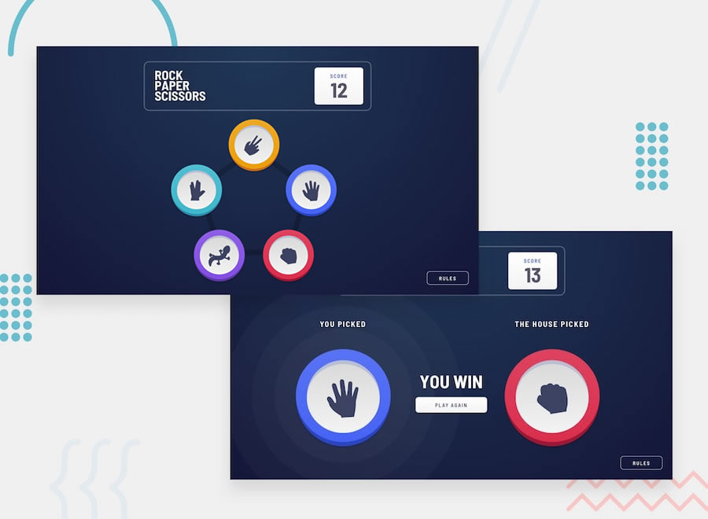

[See my solution here in GitHub](https://github.com/AOL83/Rock-Paper-Scissors-Lizard-Spock/)

# Second Module - Rock, Paper, Scissors, Lizard, spock.

## Welcome! 😁

Thanks for checking out my attempt at the Code Institutes second Module challenge / Rock - Papper - scissors - Lizard- Spock. / help from the front-end coding challenge.

[Frontend Mentor](https://www.frontendmentor.io) challenges allow you to improve your skills in a real-life workflow.

**To do this challenge, you need a basic understanding of HTML, CSS and JavaScript.**

## The challenge

My challenge was to build a Rock, Paper, Scissors game.

our users should be able to:

- View the optimal layout for the game depending on their device's screen size
- Play Rock, Paper, Scissors against the computer
- Maintain the state of the score after refreshing the browser _(optional)_
- **Bonus**: Play Rock, Paper, Scissors, Lizard, Spock against the computer _(optional)_

### Rules

If the player wins, they gain 1 point. If the computer wins, the player loses one point.

#### Original

- Paper beats Rock
- Rock beats Scissors
- Scissors beats Paper

#### Bonus

- Scissors beats Paper
- Paper beats Rock
- Rock beats Lizard
- Lizard beats Spock
- Spock beats Scissors
- Scissors beats Lizard
- Paper beats Spock
- Rock beats Scissors
- Lizard beats Paper
- Spock beats Rock

Not sure what Rock, Paper, Scissors, Lizard, Spock is? [Check out this clip from The Big Bang Theory](https://www.youtube.com/watch?v=iSHPVCBsnLw).

Want some support on the challenge? [Join our Slack community](https://www.frontendmentor.io/slack) and ask questions in the **#help** channel.

## Building my project

My code is a combination of HTML, CSS, and JavaScript that creates an interactive Rock, Paper, Scissors, Lizard, Spock game. In my rundown, we will go through each code type, their use, and purpose, and a breakdown of the JavaScript code, including any mathematical logic used, its function, and how it works. follow these steps:

1. HTML:
   The HTML code is responsible for structuring the layout of the game and includes elements such as the head, body, div, h1, h2, button, aside, input, label, section, audio, and img. The head element is where the meta information, links to external resources and stylesheets are defined. The body element is where the main content of the website is placed. The div element is used to group other elements together, and h1, h2, button, aside, input, label, section, audio, and img elements are used to create headings, buttons, forms, and multimedia content. The HTML code is used to create the structure of the game page.The code starts with the DOCTYPE declaration, which specifies that the document is an HTML5 document.The code then includes a html tag, which is the container for all HTML elements. The lang attribute is set to "en" to indicate that the document is in English.The code then includes a <head> tag, which contains metadata about the document, such as the title, character encoding, and links to CSS and JavaScript files. The link tags are used to link to external CSS and JavaScript files that are used to style and add functionality to the game.The title tag specifies the title of the game, which is displayed in the browser's title bar. The code then includes a body tag, which contains the content of the game. The code includes a h1 tag, which is used to create a heading for the game. The div tags are used to create sections and containers for the game's content. The img tag is used to add an image of the game's logo. The code also includes `button tags, which are used to create buttons for the game's functionality, such as opening and closing a modal window and playing and pausing audio. The <aside> tag is used to create a container for the background sound switch. The input and label tags are used to create the switch for turning the background sound on and off. The code also includes section tags, which are used to create different sections of the game, such as the start page and result page. The 
 tags with the class of "icon" are used to create the icons for the game's choices, such as rock, paper, scissors, lizard, and spock. The data-choice attribute is used to store the value of the choice.

2. CSS:
   The CSS code is responsible for the styling of the game. It includes properties such as background-color, background-image, background-position, background-repeat, background-size, margin, padding, border, border-radius, text-align, color, font-size, font-weight, display, flex, and transition. These properties are used to set the layout and design of the game, such as the background color and image, the font, and the size and shape of various elements. The CSS code is used to style the game page. The code starts by selecting the html element and setting the font-size, box-sizing, height, background-color, background-image, background-position, background-repeat, and background-size properties. The code then uses the \* selector to set the box-sizing property to inherit for all elements. The code then selects the body element and sets the margin, font, and focus properties. The .header class is used to style the header container of the game. The .clock class is used to style the clock that displays the date and time. The .box class is used to style the container for the audio player. The .audio-player class is used to style the audio player container. The .circle-button class is used to style the play button, and the .playing class is used to change the color of the button to green when the audio is playing. The .audio-controls class is used to style the audio control buttons. The .select-audio-button class is used to style the button for selecting audio files. The .fa-spin class is used to add a spinning animation to the play icon. The .score class is used to style the score card. The #modal id is used to style the modal window. The .sound-switch class is used to style the background sound switch.

3. JavaScript:
   The JavaScript code is responsible for the interactivity and logic of the game. It includes functions such as updateClock(), handleClick(), and event listeners such as audioFile.addEventListener(), playButton.addEventListener(), btnOpenModal.addEventListener(), xCloseModal addEventListener(), and window.addEventListener().
   The `updateClock() function is used to update the clock on the game's screen, using the built-in Date object to get the current date and time The handleClick() function is used to handle the user's choice of Rock, Paper, Scissors, Lizard, or Spock and determine the outcome of the game. Event listeners are used to listen for specific actions such as clicking a button or uploading an audio file, and respond with a specific action such as playing audio or opening a modal window. The HTML, CSS, and JavaScript code work together to create an interactive Rock, Paper, Scissors, Lizard, Spock game that includes a clock, audio player, modal window, and sound switch. The HTML provides the structure, the CSS provides the styling, and the JavaScript provides the interactivity and logic, making for a seamless and engaging user experience. The game also includes additional features such as background sound and a score card, making it a well-rounded and fully-featured game. The JavaScript code is used to add functionality to the game. The code starts by declaring variables to store references to the audio, play button,audio file, and play icon elements. An event listener is added to the audio file input to handle when a new audio file is selected. When a new file is selected, the audio element's src attribute is set to the URL of the selected file. When the play button is clicked, an event listener is triggered that checks the current state of the audio element (paused or playing). If the audio is paused, the play() method is called on the audio element, the "playing" class is added to the play button, and the "fa-spin" class is added to the play icon to show that the audio is playing. If the audio is already playing, the pause() method is called on the audio element, the "playing" class is removed from the play button, and the "fa-spin" class is removed from the play icon to show that the audio is paused. The code also includes a function for updating the clock that displays the current date and time. This function uses the setInterval() method to call the function every second. The code also includes an event listener for the "openModal" button that toggles the modal window's visibility. For the game play, the code uses the Math.floor() and Math.random() method to generate a random number between 0 and 4. This number is then used as an index to select a choice for the computer player. The code also includes event listeners for each choice icon that handles the user's choice and compares it to the computer's choice to determine the winner. The code uses the dataset property to access the value of the data-choice attribute for each choice icon, which represents the user's choice. The code also uses CSS to style the page and elements. The html element has a number of CSS styles applied to it including font-size, background-color, background-image, and background-size. The .header class is used to style the header element, and the .clock class is used to style the clock element. The .box class is used to style the container for the audio player, and the .audio-player class is used to style the audio player itself. The .circle-button class is used to style the play button, and the .audio-controls class is used to style the audio controls. This code provides a functioning rock-paper-scissors-lizard-spock game with an audio player and clock feature as well as a modal window for displaying rules. The HTML and CSS code provides the structure and layout for the page, and the JavaScript code provides the functionality for the game, audio player, clock, and modal window. The use of CSS classes and the dataset property in the JavaScript code allows for easy modification and customization of the game. Additionally, the use of mathematical methods such as Math.floor() and Math.random() allows for random selection of the computer player's choice. The JavaScript code provided in this essay is used to create an interactive Rock, Paper, Scissors, Lizard, Spock game. The code uses JavaScript to handle user interactions, update the game state and display the results. The first section of JavaScript code is for the audio player. It uses the getElementById() method to select the audio element, play button, and audio file input element. The addEventListener() method is used to listen for a change in the audio file input element, and when a change is detected, the src property of the audio element is set to the selected file using the URL.createObjectURL() method. The play button is also given a click event using the addEventListener() method, which will toggle the play and pause functionality of the audio element. The code also handles the ended event on the audio element, which will remove the playing class and the fa-spin class on the play button. The next section of JavaScript code is for the clock. It uses the setInterval() method to call the updateClock() function every second. The updateClock() function uses the Date() object to get the current date and time and then sets the innerHTML of the date and time elements to the current date and time.The next section of JavaScript code is for the modal window. It uses the querySelector() method to select the modal, modal content, open modal button, and close modal button. The addEventListener() method is used to listen for a click event on the open modal button, which will display the modal window, and the close modal button, which will hide the modal window. The code also uses an event listener on the window to check if the click event was on the modal and if so, it will hide the modal window. The next section of JavaScript code is for the game. It uses the querySelector() and querySelectorAll() methods to select the game elements and variables used in the game. The code uses an event listener on the game elements to listen for a click event, which will call the handleClick() function. The handleClick() function The handleClick() function is responsible for handling the game logic. It starts by playing the audio for the user's choice and toggling the result class on the body. It then removes any existing classes on the user and house icons, hides the play again button and message, and sets the display of the house icon to none. The function then uses the dataset property of the clicked element to get the user's choice, and generates a random number between 0 and 4 to select the house's choice. It then sets the display of the start page to none and the display of the result page to block.The function then checks the user's choice against the house's choice using a series of if-else statements. Depending on the outcome of the game, it will update the score, change the message, play the appropriate audio, and show the house's choice icon. The final section of JavaScript code is for the sound switch. It uses the querySelector() method to select the checkbox and label elements. The code uses an event listener on the checkbox to listen for a change event, which will toggle the muted property on the background sound element. Overall, the HTML, CSS, and JavaScript work together to create an interactive Rock, Paper, Scissors, Lizard, Spock game that includes a clock, audio player, modal window, and sound switch.
The JavaScript code uses methods such as getElementById(), addEventListener(), `query.

## Deploying your project

## Giving feedback on my project

Feedback is always welcome, "So" here is mine, Im going to start with my index.html page but my hole web project is written in a combination of HTML, CSS and JavaScript. The page is a game of Rock, Paper, Scissors, Lizard, Spock, from the famous U.S series the big bang theory which at hart is an extension of the traditional game of Rock, Paper, Scissors.

The code starts with the declaration of the document type, <!DOCTYPE html>, which tells the browser that this is an HTML document. The next line, <html lang="en">, declares that the document is in English.

The following lines are in the head section of the HTML document. The meta charset is set to UTF-8, which ensures that any special characters are displayed correctly. The viewport meta tag sets the width and initial scale of the webpage. A favicon is also linked to the webpage which is a 32x32 pixel image. The title of the webpage is "TERENCE LEWIS | Rock, Paper, Scissors, Lizard, Spock". The webpage also links to a stylesheet for the fonts and another for the main.css.

In the body section, the logo of the game is included, followed by a clock and a score card. The clock is implemented using JavaScript and updates the date and time in real-time. The score card keeps track of the player's score.

The webpage also includes an audio player that allows the user to play background music. The audio player includes a play button, a file input to select audio, and a label. The audio player is implemented using JavaScript and the HTML5 audio API.

The webpage also includes a button to open a modal displaying the rules of the game and a switch to turn background sound on and off.

In the main section of the webpage, the game itself is implemented. The game features icons for each of the game options - rock, paper, scissors, lizard, and spock. These icons are implemented as div elements with specific class names and data attributes. The game is implemented using JavaScript and event listeners are added to the icons to detect when they are clicked and determine the outcome of the game.

Overall, I think my code is a well-structured and functional webpage that implements a game of Rock, Paper, Scissors, Lizard, Spock, complete with an audio player, a score card, and a modal for the rules. I have used HTML, CSS, and JavaScript to create a dynamic and interactive experience for the user.

Now for my CSS.
The CSS stylesheet that controls the visual design and layout of my webpage. The CSS styles are applied to the HTML elements of the webpage.

The first CSS rule sets the font-size to 62.5%, sets the box-sizing property to border-box, sets the height to 100%, and sets the background color and background image of my webpage. The background color is set to hsl(237, 49%, 15%) and the background image is set to a radial gradient of hsl(214, 43%, 35%) and hsl(237, 49%, 15%), as well as a gif image of a animated emoji. The background-position, background-repeat, and background-size properties are also set to center, no-repeat, and cover respectively.

The next CSS rule sets the box-sizing property to inherit for all elements, which means that the box-sizing property of the parent element will be inherited by all child elements. The body element is also given a margin, font, and font-weight. A focus rule is added to set the outline of an element to 3px dotted hsl(0, 100%, 50%) when it is focused.

The .header class is used to set the display property to flex, the width and max-width to 76rem, and the margin to 0 auto. The justify-content property is set to space-between and the padding and border properties are also set.

The .clock class is used to set the font-size, font-weight, color, text-align, and padding of the clock element. The background color is set to rgba(51, 51, 51, 0) and the z-index is set to 1.

The .box class is used to set the padding-bottom property to 8rem and the margin-top property to 2rem.

The .audio-player class is used to set the position, width, and text-align of the audio player container. The .circle-button class is used to set the background color, border-radius, width, height, line-height, text-align, font-size, color, border, outline, cursor, and margin-top properties of the play button. The .circle-button.playing class is used to change the background color of the play button to green when it is played.

The .audio-controls class is used to set the position, top, and left properties. The .select-audio-button class is used to set the background color, color, padding, border-radius, border, outline, and cursor properties of the select audio button. The #audio-file id is used to hide the file input.

The .fa-spin class is used to add a class to rotate the icon using the @keyframes fa-spin animation.

The .score class is used to set the width, text-align, line-height, background, color, and border-radius properties of the score card. The .score > span class is used to set the font-size, padding, and text-transform properties of the score card.

Overall, the code is a CSS stylesheet that controls the visual design and layout of my webpage. The CSS styles are applied to the HTML elements of the webpage, including the background color, background image, font size, padding, border, and layout. The CSS stylesheet uses various CSS properties and techniques such as the use of classes, ids, and animations to create a visually appealing and responsive webpage.

Now for my JavaScript this is a JavaScript file that creates a Rock, Paper, Scissors, Lizard, Spock game. The game includes an audio player, a clock, a modal with game rules, and an interactive game page where players can select their move and play against the computer.

The first section of the code creates an audio player that allows the user to select and play a background music for the game. The audio player includes a play/pause button and an input field to select the audio file. The play button is designed to change color from white to green when the audio is playing, and the play icon is designed to rotate while the audio is playing.

The second section of the code creates a clock that displays the current date and time at the top of the page. The clock updates every second using the setInterval() function.

The third section of the code creates a modal that displays the game rules when the user clicks on the "RULES" button. The modal includes a close button that allows the user to close the modal and return to the game page.

The fourth section of the code creates the game page where the user can select their move and play against the computer. The game includes a start page where the user can select their move, and a result page that displays the user's move, the computer's move, and the outcome of the game. The game also includes a scorecard that keeps track of the user's score, and a "play again" button that allows the user to play another round.

The fifth section of the code creates global variables that are used throughout the game. These include an array of all possible choices, the start page, the result page, the scorecard, and various icons and messages that are displayed on the result page.

The sixth section of the code creates sounds for the game, these include background sound, sound for user's choice, sound for winning, sound for losing and sound for draw.

The seventh and final section of the code handles the logic of the game. When the user clicks on a move on the start page, the game generates a random move for the computer, compares the two moves, and displays the outcome on the result page. The game also updates the scorecard and plays the appropriate sound based on the outcome. The game allows the user to play again by clicking on the "play again" button.

Overall, the code provided creates an interactive and visually appealing game that combines HTML, CSS, and JavaScript to create an enjoyable experience for the user. The game includes various interactive elements such as an audio player, a clock, and a modal that adds to the overall user experience.

**Have fun playing!** 🚀

## Sponsors

A massive thank you to our community sponsors!
